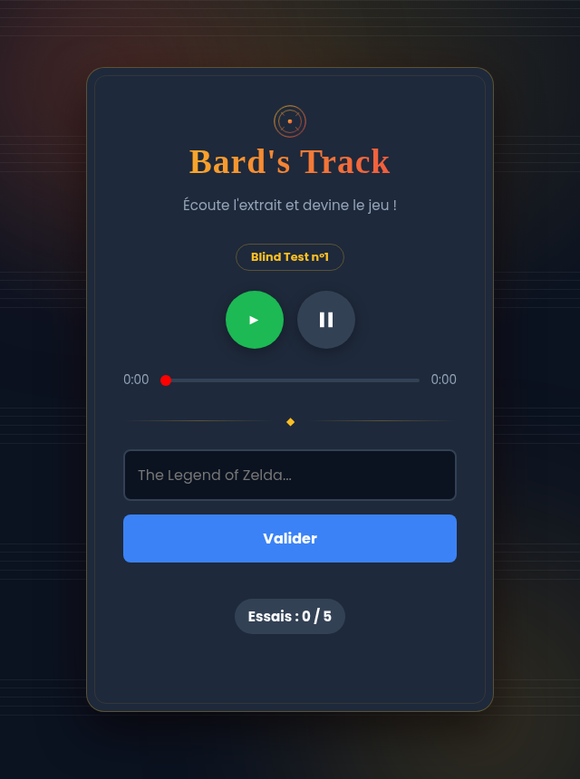

# 🎮 Bard's Track


Un blind-test musical quotidien dédié aux musiques de jeux vidéo, façon Wordle : une seule musique par jour, 5 essais pour deviner le jeu.



## Fonctionnalités

- **Un défi par jour**, identique pour tout le monde, qui ne change pas tant que la journée n'est pas terminée.
- **Anti-triche** : le lecteur YouTube est caché, les contrôles natifs sont désactivés (impossible d'avancer dans la vidéo ou de voir la miniature).
- **Réponse tolérante** : accents, casse et petites fautes de frappe sont pardonnés, sans pour autant valider un mauvais numéro d'épisode (ex. *Halo 3* ≠ *Halo 4*).
- **Anti-rejeu** : la progression du jour est mémorisée dans le navigateur, un simple F5 ne permet pas de relancer les essais.
- **Catalogue extensible** en une commande, à partir d'un simple lien YouTube.

## Comment on joue

1. On écoute l'extrait (impossible de voir la vidéo).
2. On tape le nom du jeu dans le champ, avec autocomplétion.
3. On valide : bonne ou mauvaise réponse, l'essai est décompté.
4. 5 essais maximum, un seul jeu à deviner par jour.

## Stack technique

| Côté | Techno |
|---|---|
| Backend | FastAPI + SQLAlchemy |
| Base de données | SQLite |
| Frontend | HTML / CSS / JavaScript vanilla |
| Lecture audio | YouTube IFrame API |

## Structure du projet

```
Bards-Track/
├── main.py              # API FastAPI (routes + logique du "tirage du jour")
├── database.py          # Modèles SQLAlchemy (Jeu, Piste, TirageDuJour)
├── import_csv.py        # Importe musiques.csv dans la base
├── ajouter_musique.py   # Ajoute une musique à partir d'un simple lien YouTube
├── musiques.csv         # Le catalogue de musiques (source de vérité)
├── requirements.txt
├── .gitignore
└── static/              # Le site servi par FastAPI
    ├── index.html
    ├── style.css
    └── script.js
```

## Installation en local

```bash
git clone https://github.com/Dams117/Bards-Track.git
cd Bards-Track

python -m venv venv
venv\Scripts\Activate.ps1      # sous Windows (PowerShell)
# source venv/bin/activate     # sous macOS / Linux

pip install -r requirements.txt

uvicorn main:app --reload
```

Puis ouvrir **http://127.0.0.1:8000/** dans le navigateur. Le catalogue (`musiques.csv`) est importé automatiquement dans la base au démarrage.

## Ajouter une musique au catalogue

```bash
python ajouter_musique.py "Nom du jeu" "https://youtu.be/xxxxxxxxxxx?t=45"
python import_csv.py
```

Le lien peut être copié directement depuis YouTube (clic droit sur la vidéo → *Copier l'URL de la vidéo à l'horodatage actuel*) : l'ID et le timestamp de départ sont extraits automatiquement.

## Déploiement

Le projet est pensé pour tourner comme un service unique (API + site) : `main.py` sert le dossier `static/` et réimporte `musiques.csv` à chaque démarrage, ce qui le rend compatible avec un hébergement au disque éphémère (ex. [Render](https://render.com), tier gratuit).

- **Build command** : `pip install -r requirements.txt`
- **Start command** : `uvicorn main:app --host 0.0.0.0 --port $PORT`

## Projet

Réalisé dans le cadre d'un projet scolaire.
